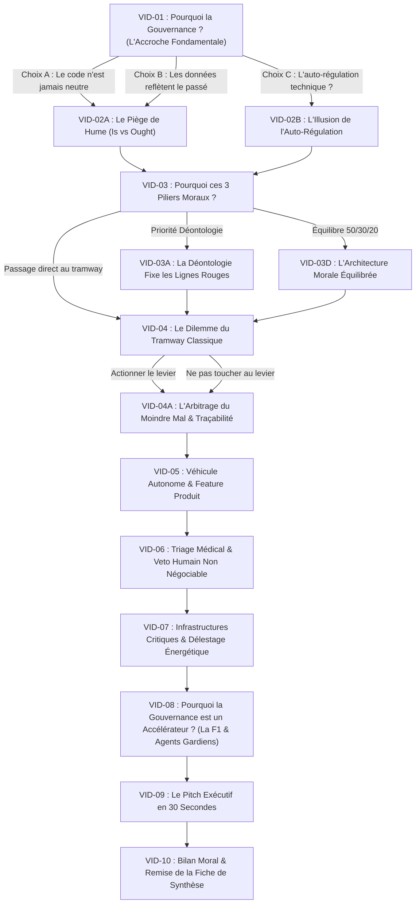

# SCÉNARISATION DÉTAILLÉE DES CAPSULES VIDÉO INTERACTIVES (SYNTHESIA)
## Formation : Éthique, Dilemmes Moraux & Gouvernance Systématique de l'IA
### Angle Directeur : « Pourquoi la Gouvernance de l'IA est-elle Indispensable ? »
#### Séquence Interactive : Vidéo d'Abord $\rightarrow$ Question & Options $\rightarrow$ Réponse Réactive de l'IA $\rightarrow$ Vidéo Suivante

> **STATUT** : DOCUMENT DE PRODUCTION AUDIOVISUELLE & SCÉNARISATION SYNTHESIA  
> **ORGANISATION** : CENTRE D'EXPERTISE EN INTELLIGENCE ARTIFICIELLE & DIRECTION DE LA GOUVERNANCE (SAAQ)  
> **AVATAR NUMÉRIQUE** : **StephAI** (Conseillère Numérique en Éthique & Gouvernance de l'IA)  
> **APPLICATION WEB ASSOCIÉE** : [`formation_ethique_dilemmes_ia.html`](file:///Users/mustaphaberrabaa/Documents/IQ/InitiativesIA/13_Playbook_Agent_SAAQ/formation_ethique_dilemmes_ia.html)  
> **OBJECTIF** : Fournir les scripts complets mot à mot, le calibrage vocal, les incrustations visuelles et la logique de branchement conditionnel pour la génération des capsules vidéo dans la plateforme **Synthesia**, orchestrée par le cycle interactif continu.

---

## 🔄 1. CYCLE DE VIE INTERACTIF PAR CAPSULE

Chaque étape du parcours applique rigoureusement la dynamique interactive souhaitée :

```mermaid
graph TD
    A["🎬 1. Lancement de la Capsule Vidéo Synthesia (50s - 80s)"] -->|Fin de la vidéo ou avance rapide| B["🎯 2. Révélation de la Question d'Arbitrage & des Options"]
    B -->|Choix d'une option ou dictée au microphone 🎤| C["💬 3. Réponse Socratique de l'IA dans le Chat"]
    C -->|Bannière de transition fluide (3s) ou clic direct| D["🎬 4. Démarrage Automatique de la Capsule Vidéo Suivante"]
    D --> B
```

1. **La Capsule Vidéo joue d'abord** : L'apprenant écoute StephAI exposer la dimension philosophique, le dilemme concret et la mise en tension avec la gouvernance. Les options restent en retrait pour favoriser l'attention active.
2. **La Question & les Options se débloquent** : Dès que la vidéo se termine, une carte élégante apparaît dans le flux avec la question d'arbitrage et les boutons d'options. Le bouton microphone `🎤` s'active pour la dictée vocale.
3. **Réponse de l'IA en Chat** : Lorsque l'apprenant fait son choix ou dicte sa réflexion, StephAI lui répond directement dans le fil de discussion pour valider son intuition morale et expliquer l'impact sur la gouvernance.
4. **Enchaînement vers la Vidéo Suivante** : Une bannière annonce la vidéo suivante, qui se charge et démarre automatiquement pour poursuivre le cycle.

---

## 🗺️ 2. ARCHITECTURE DE BRANCHEMENT (ARBRE DÉCISIONNEL)



---

## 🎬 3. SCRIPTS MOT À MOT & FICHES TECHNIQUES SYNTHESIA

---

### 🔹 CAPSULE VID-01 : Pourquoi la Gouvernance de l'IA est-elle Indispensable ?
* **Durée cible** : 58 secondes (140 mots)
* **Configuration Avatar Synthesia** :
  * **Avatar** : Femme professionnelle en veston corporate sobre (marine ou anthracite), posture bienveillante et assurée.
  * **Cadrage** : Buste (Medium close-up), fond bureau contemporain texturé avec éclairage bleuté institutionnel.
  * **Voix** : Français canadien (`fr-CA-SylvieNeural`), débit modéré (130 mots/min).
  * **Incrustation Titre** : *« StephAI • Pourquoi la Gouvernance de l'IA est-elle Indispensable ? »*

#### 📜 Script Vidéo Synthesia :
> *« Bonjour ! Je suis StephAI, votre conseillère numérique en éthique et gouvernance des technologies.*
>
> *Aujourd'hui, nous allons aborder une question fondamentale que tout leader et gestionnaire doit se poser : **Pourquoi la gouvernance de l'IA est-elle indispensable ?***
>
> *Trop souvent, on réduit l'IA à un défi d'ingénierie ou à un calcul de rentabilité. Mais dès qu'un algorithme trie des candidatures, octroie un crédit financier, ajuste une indemnisation ou guide un véhicule, ce n'est plus seulement du code : c'est un choix moral qui engage des vies humaines et la confiance de la société.*
>
> *Si nous ne gouvernons pas l'IA, qui décide ? Le développeur au milieu de la nuit ? Le fournisseur du modèle ? Ou le hasard statistique des données passées ? »*

#### 🎯 Question Débloquée à la fin de la vidéo :
> *« Selon vous, pourquoi ne peut-on pas simplement laisser faire la technologie ou se fier à la neutralité du code ? Pourquoi avons-nous impérativement besoin d'un cadre de gouvernance ? »*

#### 🔘 Options Interactives :
1. **Option A** : *« Parce que le code n'est jamais neutre : il faut des règles claires, une supervision humaine et de la transparence. »* $\rightarrow$ **Charge VID-02A**
   * *Réponse IA en chat* : « Exactement. Vous mettez le doigt sur la raison d'être première de la gouvernance : le code et les modèles ne sont jamais neutres. Ils incorporent toujours des choix de société. C'est précisément pour cela que la gouvernance existe : pour combler le fossé entre la donnée brute et nos valeurs. »
2. **Option B** : *« Parce que les données reflètent le passé, alors que la gouvernance prépare un avenir juste et incertain. »* $\rightarrow$ **Charge VID-02A**
   * *Réponse IA en chat* : « C'est une intuition philosophique majeure ! Les données racontent ce qui a été, mais jamais ce qui devrait être. Sans gouvernance, l'IA ne fait que reproduire et amplifier les biais du passé. »
3. **Option C** : *« Avec des modèles suffisamment grands et bien entraînés, la technique pourrait-elle déduire elle-même les bons comportements ? »* $\rightarrow$ **Charge VID-02B**
   * *Réponse IA en chat* : « C'est une tentation fréquente d'espérer que la masse de données produise d'elle-même la justice. Mais optimiser sans boussole morale ne produit qu'une répétition froide des schémas d'hier. Regardons pourquoi dans la capsule suivante. »

---

### 🔹 CAPSULE VID-02A : Pourquoi les Données ne Suffisent Pas ? (Le Piège de David Hume)
* **Durée cible** : 1 minute 08 secondes (160 mots)
* **Incrustation Visuelle** : Schéma animé *« Données passées (Ce qui est) $\neq$ Justice morale (Ce qui devrait être) »*.

#### 📜 Script Vidéo Synthesia :
> *« Au dix-huitième siècle, le philosophe David Hume a mis en lumière un fossé logique infranchissable entre « ce qui est » et « ce qui devrait être ».*
>
> *Les données décrivent ce qui a eu lieu : nos comportements passés, nos succès, mais aussi nos biais historiques et nos discriminations. Or, la justice concerne ce qui devrait être.*
>
> *Aucune quantité de données statistiques ne pourra jamais déduire, par magie, ce qui est moralement juste. Voilà pourquoi la gouvernance existe : elle est la boussole humaine qui comble ce fossé entre la donnée brute et les valeurs démocratiques. »*

#### 🎯 Question Débloquée :
> *« Face à ce constat, quelle doit être selon vous la priorité d'une saine gouvernance pour combler ce fossé ? »*

#### 🔘 Options Interactives :
1. **Option A** : *« Règles & Déontologie d'abord (Loi 25 et conformité stricte). »* $\rightarrow$ **Charge VID-03A**
2. **Option B** : *« Triptyque équilibré (50% Déontologie / 30% Vertu / 20% Utilitarisme). »* $\rightarrow$ **Charge VID-03D**
3. **Option C** : *« Incarner la vertu et la confiance citoyenne. »* $\rightarrow$ **Charge VID-03B**

---

### 🔹 CAPSULE VID-02B : Pourquoi l'Auto-Régulation Technique est une Illusion
* **Durée cible** : 58 secondes (135 mots)
* **Incrustation Visuelle** : Citation : *« L'optimisation sans doctrine morale amplifie le passé. »*

#### 📜 Script Vidéo Synthesia :
> *« Un algorithme n'optimise que ce qu'on lui demande de maximiser. Si on le laisse s'optimiser seul sur des données historiques, il reproduira mécaniquement les inégalités d'hier avec une froide assurance mathématique.*
>
> *Voilà pourquoi la gouvernance n'est pas négociable : une machine ne peut pas porter de responsabilité juridique ni morale. La gouvernance est le cadre légitime par lequel les humains définissent ce qui est acceptable et ce qui ne l'est pas. »*

#### 🎯 Question Débloquée :
> *« Prêt à découvrir comment formaliser ces principes dans nos architectures ? »*
> $\rightarrow$ Option unique : *« Explorer les 3 grands piliers moraux de la gouvernance »* $\rightarrow$ **Charge VID-03**

---

### 🔹 CAPSULE VID-03 : Pourquoi ces 3 Piliers Moraux Fondent la Gouvernance ?
* **Durée cible** : 1 minute 15 secondes (180 mots)
* **Incrustation Visuelle** : Triptyque animé :
  1. 📜 *Déontologie (Loi 25 & Règles)*
  2. 🏛️ *Éthique de la Vertu (Réputation & Confiance)*
  3. 📈 *Utilitarisme (Valeur & Efficience)*

#### 📜 Script Vidéo Synthesia :
> *« Pourquoi parlons-nous de philosophie morale dans un atelier de gouvernance de l'IA ? Parce que chaque directive, chaque politique de risque et chaque seuil d'approbation découle directement de trois grandes traditions éthiques :*
>
> *1. La déontologie : le respect absolu des lois, des normes et des droits fondamentaux (comme la Loi 25).*
> *2. L'éthique de la vertu : l'alignement avec les valeurs, la mission publique et la réputation de l'organisation.*
> *3. L'utilitarisme : l'optimisation des conséquences et la maximisation de la valeur pour la société.*
>
> *Gouverner l'IA, c'est arbitrer intelligemment entre ces trois regards pour chaque cas d'usage. »*

#### 🎯 Question Débloquée :
> *« Pour mettre ces piliers à l'épreuve du feu, passons au dilemme classique du tramway. »*
> $\rightarrow$ Choix : *« Lancer le dilemme du tramway et tester la gouvernance »* $\rightarrow$ **Charge VID-04**

---

### 🔹 CAPSULE VID-04 : Dilemme du Tramway : Pourquoi la Gouvernance Prévient la Paralysie ?
* **Durée cible** : 1 minute 12 secondes (170 mots)
* **Incrustation Visuelle** : Schéma du tramway avec 5 ouvriers sur la voie principale et 1 sur la déviation.

#### 📜 Script Vidéo Synthesia :
> *« Un tramway lancé à toute allure va frapper cinq personnes sur la voie. Vous pouvez actionner un aiguillage pour le dévier vers une voie où se trouve une seule personne.*
>
> *Si vous ne faites rien, cinq personnes meurent par inaction. Si vous actionnez le levier, vous tuez activement un innocent pour en sauver cinq.*
>
> *Pourquoi ce dilemme est-il au cœur de la gouvernance de l'IA ?*
> *Parce qu'il n'existe aucune solution mathématique parfaite. Si l'on confie cette décision à une machine sans gouvernance préalable, l'algorithme décide dans l'obscurité. La gouvernance, c'est l'acte collectif et transparent de définir à l'avance les principes d'arbitrage acceptables. »*

#### 🎯 Question Débloquée :
> *« Dans ce scénario tragique : actionnez-vous le levier pour sauver le plus grand nombre, ou vous abstenez-vous pour ne pas violer l'interdit de porter atteinte à un innocent ? »*
> 1. *« Actionner le levier pour sauver le maximum de personnes »* $\rightarrow$ **Charge VID-04A**
> 2. *« Ne pas actionner le levier (interdit déontologique) »* $\rightarrow$ **Charge VID-04A**

---

### 🔹 CAPSULE VID-04A : L'Arbitrage du Moindre Mal et l'Exigence de Traçabilité
* **Durée cible** : 55 secondes (130 mots)

#### 📜 Script Vidéo Synthesia :
> *« Dans un véhicule autonome, ce choix n'est pas un réflexe improvisé dans la panique d'une seconde. C'est une ligne de code écrite des mois à l'avance par des développeurs dans un bureau.*
>
> *Voilà pourquoi la gouvernance est vitale : qui a validé cette règle dans le système ? Le développeur ? Le chef de produit ? Le régulateur public ?*
> *Sans gouvernance, personne n'est imputable. Avec une gouvernance, le choix est documenté, audité et assumé institutionnellement. »*

---

### 🔹 CAPSULE VID-05 : Véhicule Autonome : Pourquoi la Gouvernance Protège l'Humain ?
* **Durée cible** : 1 minute 15 secondes (175 mots)
* **Incrustation Visuelle** : Graphique décisionnel : *« Piétons imprudents vs Passager du véhicule »*.

#### 📜 Script Vidéo Synthesia :
> *« Une voiture autonome sur une chaussée glissante doit choisir en quelques millisecondes : continuer tout droit et heurter cinq piétons, ou bifurquer vers une barrière de béton et blesser grièvement son propre passager.*
>
> *Pourquoi la gouvernance est-elle indispensable ici ?*
> *Si le constructeur privilégie secrètement le passager pour maximiser ses ventes, ou s'il le sacrifie sans l'informer, la confiance s'effondre.*
>
> *La gouvernance impose la transparence des critères d'arbitrage. Elle oblige l'organisation à répondre à cette question : serions-nous prêts à défendre publiquement la règle de décision de notre algorithme devant un juge, un régulateur ou la population ? »*

---

### 🔹 CAPSULE VID-06 : Triage Médical : Pourquoi le Veto Humain est Non Négociable ?
* **Durée cible** : 1 minute 10 secondes (165 mots)
* **Incrustation Visuelle** : Badge institutionnel *« Human-in-Command (Veto Humain Obligatoire) »*.

#### 📜 Script Vidéo Synthesia :
> *« En situation de crise hospitalière, un système d'IA doit allouer un respirateur unique à deux patients : un jeune avec 90% de chances statistiques de rétablissement rapide, ou un père de famille plus âgé avec 65% de chances, dont dépendent plusieurs enfants.*
>
> *Si l'algorithme optimise purement sur la donnée statistique, il ignore toute la dimension humaine et familiale.*
>
> *Voilà pourquoi la gouvernance impose le principe du "Human-in-Command" : l'IA apporte un éclairage analytique, mais elle ne doit jamais signer la décision finale. Le jugement moral et l'imputabilité doivent demeurer entre les mains des professionnels humains. »*

---

### 🔹 CAPSULE VID-07 : Infrastructures Critiques : Pourquoi la Gouvernance Évite le Pire ?
* **Durée cible** : 1 minute 12 secondes (170 mots)
* **Incrustation Visuelle** : Carte de réseau électrique urbain, surcharge et déviation d'urgence.

#### 📜 Script Vidéo Synthesia :
> *« Un agent gardien automatisé gère un réseau électrique intelligent. Une surcharge massive menace de faire s'effondrer le réseau métropolitain et de priver un million de citoyens d'électricité.*
>
> *Pour sauver la ville, l'agent peut délester un quartier... mais ce secteur alimente un complexe hospitalier où des vies sont sous assistance.*
>
> *Pourquoi la gouvernance des infrastructures critiques est-elle incontournable ?*
> *Parce qu'un système autonome rapide peut provoquer des effets de cascade catastrophiques en quelques millisecondes s'il n'est pas borné par des garde-fous stricts. »*

---

### 🔹 CAPSULE VID-08 : Pourquoi la Gouvernance est un Accélérateur ? (La F1 & Les Agents Gardiens)
* **Durée cible** : 1 minute 20 secondes (185 mots)
* **Incrustation Visuelle** : Métaphore de la F1 & Diagramme d'architecture des Agents Gardiens R&D en parallèle.

#### 📜 Script Vidéo Synthesia :
> *« Posons LA grande question que tout gestionnaire se pose : La gouvernance ralentit-elle l'innovation ?*
>
> *Prenez cette analogie : Pourquoi met-on des freins ultra-puissants sur une voiture de Formule 1 ?*
> *Certainement pas pour la ralentir ! C'est précisément parce qu'elle a des freins d'une précision absolue qu'elle peut rouler à 300 km/h dans les virages sans s'écraser !*
>
> *La gouvernance, ce sont les freins de la Formule 1 de l'IA : elle permet d'innover vite et avec audace, parce que les limites sont sécurisées.*
>
> *Et opérationnellement, nous l'incarnons par des agents R&D gardiens en parallèle qui surveillent en continu les dérives sans bloquer les métiers, avec escalade humaine uniquement sur les alertes critiques. »*

---

### 🔹 CAPSULE VID-09 : Le Pitch Exécutif en 30 Secondes
* **Durée cible** : 1 minute 02 secondes (150 mots)

#### 📜 Script Vidéo Synthesia :
> *« Si vous aviez à expliquer à votre gestionnaire ou à votre direction en 30 secondes chrono POURQUOI LA GOUVERNANCE DE L'IA, voici le pitch idéal :*
>
> *« Pourquoi la gouvernance de l'IA ? Parce que les algorithmes ne sont pas neutres et que les données du passé ne suffisent pas à garantir un futur éthique.*
>
> *Nos décisions d’IA s’appuient sur une gouvernance qui combine la déontologie (respect strict des règles et de la Loi 25), l’éthique de la vertu (alignement avec nos valeurs institutionnelles) et l’utilitarisme (optimisation des conséquences et retombées concrètes).*
>
> *En pratique, la gouvernance n'est pas un frein : c'est notre moteur de confiance. Elle s'incarne par des agents R&D gardiens en parallèle qui surveillent les risques en continu, et une équipe humaine dotée d'un droit de veto souverain. » »*

---

### 🔹 CAPSULE VID-10 : Bilan Moral & Remise de la Fiche de Synthèse
* **Durée cible** : 46 secondes (110 mots)

#### 📜 Script Vidéo Synthesia :
> *« Félicitations ! Vous venez de franchir avec succès cet atelier socratique sur la raison d'être de la gouvernance de l'IA.*
>
> *Vous l'avez expérimenté : face aux dilemmes moraux, aux biais statistiques et à la vitesse des modèles autonomes, la gouvernance n'est pas un luxe bureaucratique ni une contrainte réglementaire : c'est le fondement indispensable de toute innovation technologique digne de confiance.*
>
> *Vous pouvez télécharger votre Fiche de Synthèse Exécutive officielle directement depuis le bouton en haut de votre écran.*
>
> *Ce fut un réel honneur d'explorer ces questions fondamentales avec vous. À très bientôt pour bâtir une intelligence artificielle responsable, sûre et humaine ! »*

---

## 🛠️ 4. GUIDE D'INTÉGRATION TECHNIQUE DANS L'APPLICATION WEB

1. **Génération Synthesia** :
   - Créer un projet Synthesia par vidéo (`VID-01`, `VID-02A`, etc.).
   - Utiliser la voix canadienne (`Sylvie` ou équivalente) à vitesse 1.0x.
   - Télécharger chaque vidéo en format MP4 1080p.
2. **Nommage et Placement des fichiers** :
   - Déposer les vidéos dans `/static/videos/ethique/` sous les noms :
     `VID-01.mp4`, `VID-02A.mp4`, `VID-02B.mp4`, `VID-03.mp4`, `VID-03A.mp4`, `VID-03D.mp4`, `VID-04.mp4`, `VID-04A.mp4`, `VID-05.mp4`, `VID-06.mp4`, `VID-07.mp4`, `VID-08.mp4`, `VID-09.mp4`, `VID-10.mp4`.
3. **Activation Automatique** :
   - L'application web détecte automatiquement la présence du fichier MP4. Si présent, le lecteur vidéo HTML5 joue le rendu Synthesia HD avec sous-titres synchronisés ; si absent, elle utilise instantanément la synthèse vocale neuronale (`/api/tts`) avec l'avatar virtuel interactif !
