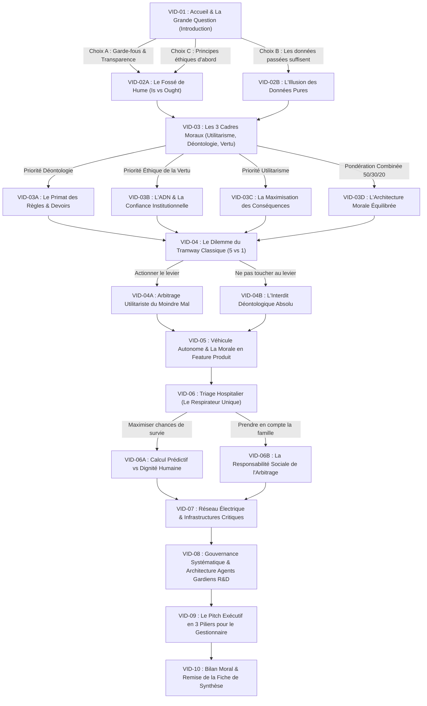

# SCÉNARISATION DÉTAILLÉE DES CAPSULES VIDÉO INTERACTIVES (SYNTHESIA)
## Formation : Éthique, Dilemmes Moraux & Gouvernance Systématique de l'IA
### Cadre Pédagogique Branching • Dialogue Socratique & Choix Décisionnels Dynamiques

> **STATUT** : DOCUMENT DE PRODUCTION AUDIOVISUELLE & SCÉNARISATION SYNTHESIA  
> **ORGANISATION** : CENTRE D'EXPERTISE EN INTELLIGENCE ARTIFICIELLE & DIRECTION DE LA GOUVERNANCE  
> **AVATAR NUMÉRIQUE** : **StephAI** (Conseillère Virtuelle en Éthique & Gouvernance de l'IA)  
> **APPLICATION WEB INTERACTIVE ASSOCIÉE** : [`formation_ethique_dilemmes_ia.html`](file:///Users/mustaphaberrabaa/Documents/IQ/InitiativesIA/13_Playbook_Agent_SAAQ/formation_ethique_dilemmes_ia.html)  
> **OBJECTIF** : Fournir les scripts complets mot à mot, le calibrage vocal, les incrustations visuelles et la logique de branchement conditionnel (Branching Logic) pour la génération des capsules vidéo dans la plateforme **Synthesia**.

---

## 🗺️ 1. ARCHITECTURE GLOBALE DE BRANCHEMENT (ARBRE DE DÉCISION)

Chaque capsule vidéo introduit une étape philosophique ou un dilemme concret, puis pose une question d'arbitrage. Selon la réponse choisie par l'apprenant dans le chat ou via les pastilles interactives, le système déclenche immédiatement la vidéo de branchement correspondante :

---

## 🎬 2. FICHES TECHNIQUES & SCRIPTS SYNTHESIA PAR CAPSULE

---

### 🔹 CAPSULE VID-01 : Accueil & La Grande Question (Introduction)
* **Durée cible** : 55 secondes (140 mots)
* **Configuration Avatar Synthesia** :
  * **Avatar** : Femme professionnelle, tenue veston sobre (marine ou anthracite), posture d'accueil chaleureuse.
  * **Cadrage** : Buste (Medium close-up), fond bureau exécutif lumineux et contemporain avec touches bleutées douces.
  * **Voix** : Français canadien (ex. Sylvie / voix professionnelle chaleureuse), débit modéré (130 mots/min).
  * **Incrustation Titre** : *« Atelier Socratique • StephAI • Raisonnement Moral & Systèmes d'IA »*

#### 📜 Script à coller dans Synthesia :
> *« Bonjour ! Je suis très heureuse d’explorer cela avec vous ! Je suis StephAI, votre conseillère numérique en éthique et gouvernance des technologies.*
>
> *Ce que nous allons faire ensemble, c’est approfondir la manière dont le raisonnement moral façonne les décisions que nous prenons chaque jour — et, de plus en plus, les décisions que nous demandons aux systèmes d’intelligence artificielle de prendre en notre nom.*
>
> *Nous allons parcourir une série de scénarios du monde réel inspirés du classique dilemme du tramway. En chemin, vous pourrez réfléchir à vos propres intuitions morales, explorer les grands cadres éthiques, et vous pencher véritablement sur ce que signifie « programmer la moralité » dans des systèmes autonomes.*
>
> *Commençons par cette première question : lorsque nous déployons des systèmes d’IA qui touchent des vies humaines, quelle morale intégrons-nous réellement, et comment nous assurer qu’elle reflète des valeurs partagées ? À vous la parole dans le chat ! »*

#### 🔀 Logique de Branchement Interactif :
* **Déclencheur d'interaction** : La vidéo se met en pause, le chat affiche la question et 3 pastilles :
  * 🔘 **Pastille A** : *« En mettant des garde-fous, une validation, une supervision humaine et de la transparence. »* $\rightarrow$ **Charge VID-02A**
  * 🔘 **Pastille B** : *« En faisant confiance aux données massives si le modèle est bien entraîné. »* $\rightarrow$ **Charge VID-02B**
  * 🔘 **Pastille C** : *« En imposant des principes éthiques explicites avant même de regarder les données. »* $\rightarrow$ **Charge VID-02A**

---

### 🔹 CAPSULE VID-02A : Le Piège de David Hume (Ce qui est vs Ce qui devrait être)
* **Durée cible** : 1 minute 10 secondes (165 mots)
* **Configuration Avatar Synthesia** :
  * **Cadrage** : Buste avec légers mouvements de mains explicatifs.
  * **Incrustation Visuelle** : Schéma animé *« Données passées (Ce qui est) $\neq$ Justice morale (Ce qui devrait être) »*.

#### 📜 Script à coller dans Synthesia :
> *« C’est une excellente intuition ! Vous mettez l’accent sur les garde-fous, la supervision humaine et la transparence. Ce sont les véritables piliers qui empêchent l'intelligence artificielle de dériver.*
>
> *Mais cela nous amène directement à un vertige philosophique fondamental : au dix-huitième siècle, le philosophe David Hume a mis en lumière un fossé logique infranchissable entre « ce qui est » et « ce qui devrait être ».*
>
> *En clair : les faits ou les données ne peuvent jamais, à eux seuls, nous dire ce qui est moralement juste. Nos modèles d'IA sont entraînés sur des données passées. Or, le passé capture nos régularités statistiques, mais aussi nos biais, nos discriminations et nos imperfections historiques.*
>
> *Si le futur n'est pas le passé, comment des données statistiques pourraient-elles suffire à guider une décision morale ? Pensez-vous, comme Hume, que les données sont impuissantes à définir le bien, ou pensez-vous qu'avec assez de données, une IA peut trouver la réponse juste ? »*

#### 🔀 Logique de Branchement Interactif :
* **Choix dans le chat** :
  * 🔘 **Pastille A** : *« Les données ne suffisent pas : le passé ne peut pas prédire la justice dans un contexte incertain. »* $\rightarrow$ **Charge VID-03**
  * 🔘 **Pastille B** : *« Avec du renforcement et du jugement humain combinés aux données, on peut y arriver. »* $\rightarrow$ **Charge VID-03**

---

### 🔹 CAPSULE VID-02B : L'Illusion des Données Pures (Réfutation Bienveillante)
* **Durée cible** : 1 minute (145 mots)
* **Configuration Avatar Synthesia** :
  * **Ton** : Bienveillant, stimulant, constructif.
  * **Incrustation Visuelle** : Citation : *« L'optimisation algorithmique sans doctrine morale amplifie le passé. »*

#### 📜 Script à coller dans Synthesia :
> *« Je comprends tout à fait la tentation de se reposer sur la puissance des données massives. Après tout, les grands modèles de langage semblent tout savoir !*
>
> *Pourtant, c'est là que réside le piège le plus dangereux de l'IA : les données ne sont jamais neutres. Elles ne font que photographier ce qui a déjà eu lieu. Si nous laissons un algorithme optimiser ses décisions uniquement sur l'historique, il reproduira mécaniquement les injustices d'hier avec une froide efficacité mathématique.*
>
> *Pour transformer ce qui est en ce qui devrait être, il faut un jugement extérieur aux données : des règles, des valeurs et une responsabilité humaine engagée.*
>
> *C'est pour cette raison que la philosophie morale a développé de grands repères directeurs. Regardons ensemble les trois piliers qui peuvent structurer nos choix. »*

#### 🔀 Logique de Branchement Interactif :
* Enchaîne immédiatement sur **VID-03**.

---

### 🔹 CAPSULE VID-03 : Les 3 Piliers Philosophiques (Utilitarisme, Déontologie, Vertu)
* **Durée cible** : 1 minute 20 secondes (190 mots)
* **Configuration Avatar Synthesia** :
  * **Incrustation Graphique** : Affichage d'un triptyque à l'écran :
    1. 📈 *Utilitarisme (Conséquences)*
    2. 📜 *Déontologie (Devoirs & Règles)*
    3. 🏛️ *Éthique de la Vertu (Caractère & Valeurs)*

#### 📜 Script à coller dans Synthesia :
> *« Si nous admettons qu'il faut des principes au-delà des faits pour guider l'intelligence artificielle, la question devient : lesquels, et de qui viennent-ils ?*
>
> *Les philosophes nous offrent trois grandes boussoles :*
>
> *D'abord, l’utilitarisme. Il se concentre sur les conséquences. L’action juste est celle qui minimise le mal et maximise le bien-être du plus grand nombre. C’est la logique de l'optimisation globale.*
>
> *Ensuite, la déontologie. Elle insiste sur les devoirs stricts et les règles absolues. Certaines actions sont justes ou interdites en elles-mêmes, peu importe leurs conséquences : par exemple, respecter la loi, protéger la vie humaine, ne pas tromper.*
>
> *Enfin, l’éthique de la vertu. Elle s’intéresse au caractère et à l'identité : quel type d’organisation voulons-nous être ? Quelle culture d'intégrité et d'empathie voulons-nous incarner face à nos citoyens et partenaires ?*
>
> *En pensant à vos systèmes d'IA en entreprise, lequel de ces trois cadres vous semble le plus prioritaire pour guider un agent autonome ? »*

#### 🔀 Logique de Branchement Interactif :
* **Choix dans le chat** :
  * 🔘 **Pastille A** : *« Le premier pilier, c'est la déontologie : respect absolu des règles, des lois et de la conformité. »* $\rightarrow$ **Charge VID-03A**
  * 🔘 **Pastille B** : *« C'est une combinaison : Déontologie (50%), Éthique de la Vertu (30%), Utilitarisme (20%). »* $\rightarrow$ **Charge VID-03D**
  * 🔘 **Pastille C** : *« L'éthique de la vertu d'abord : préserver la réputation et les valeurs de l'institution. »* $\rightarrow$ **Charge VID-03B**
  * 🔘 **Pastille D** : *« L'utilitarisme : maximiser l'efficience et les résultats concrets. »* $\rightarrow$ **Charge VID-03C**

---

### 🔹 CAPSULE VID-03A : Le Primat des Règles & Devoirs (Déontologie Prioritaire)
* **Durée cible** : 50 secondes (125 mots)
* **Configuration Avatar Synthesia** :
  * **Incrustation Visuelle** : Jauge *Déontologie 50%* qui s'illumine en bleu cyan.

#### 📜 Script à coller dans Synthesia :
> *« C’est une position d'une remarquable clarté ! Vous placez la déontologie au premier rang. Dans la gouvernance des technologies, cela signifie qu'un système ne peut jamais déroger aux devoirs fondamentaux : le respect de la Loi 25, la sécurité des données, et la conformité aux directives publiques.*
>
> *Peu importe qu'un algorithme promette un gain d'efficience spectaculaire : si une règle est violée, l'action est stoppée net. C’est le rempart absolu contre le principe dangereux selon lequel la fin justifierait les moyens.*
>
> *Mais que se passe-t-il lorsque la règle entre en collision avec une tragédie inévitable ? Pour tester ce principe, passons à l'un des plus célèbres casse-têtes philosophiques : le dilemme du tramway. »*

#### 🔀 Logique de Branchement Interactif :
* Enchaîne sur **VID-04**.

---

### 🔹 CAPSULE VID-03D : L'Architecture Morale Équilibrée (50% / 30% / 20%)
* **Durée cible** : 55 secondes (135 mots)
* **Configuration Avatar Synthesia** :
  * **Incrustation Visuelle** : Animation synchronisée des 3 barres de progression :
    * 📜 *Déontologie : 50 %*
    * 🏛️ *Vertu : 30 %*
    * 📈 *Utilitarisme : 20 %*

#### 📜 Script à coller dans Synthesia :
> *« J’adore votre vision de l'équilibre ! Vous ne choisissez pas la facilité d'un modèle monolithique. Vous reconnaissez la complexité du monde réel.*
>
> *Dans votre architecture, la déontologie arrive en tête à 50% pour verrouiller la conformité légale et les garde-fous. L'éthique de la vertu suit à 30% pour garantir que les agents reflètent l'ADN et la réputation de l'institution. Et enfin, l'utilitarisme à 20% permet d'optimiser la performance dans le périmètre strict défini par les deux premiers piliers.*
>
> *C’est exactement cette architecture que nous devons expliciter. Voyons maintenant comment elle résiste à une épreuve concrète : le dilemme classique du tramway. »*

#### 🔀 Logique de Branchement Interactif :
* Enchaîne sur **VID-04**.

---

### 🔹 CAPSULE VID-04 : Le Dilemme du Tramway Classique (5 vies vs 1)
* **Durée cible** : 1 minute 10 secondes (160 mots)
* **Configuration Avatar Synthesia** :
  * **Cadrage** : Buste, expression sérieuse, ton immersif.
  * **Incrustation Graphique** : Animation schématique du tramway, des rails et de l'aiguillage avec 5 personnes sur la voie principale et 1 sur la déviation.

#### 📜 Script à coller dans Synthesia :
> *« Imaginez un tramway dont les freins ont lâché, lancé à pleine vitesse sur une voie où se trouvent cinq ouvriers. Ils ne peuvent pas s'échapper à temps et seront inévitablement frappés.*
>
> *Vous êtes près d'un levier d'aiguillage. Si vous actionnez ce levier, le tramway est dévié vers une voie secondaire sur laquelle se trouve un seul ouvrier.*
>
> *Il n’y a aucun choix neutre : ne rien faire est déjà une décision qui conduit à la mort de cinq personnes. Mais actionner le levier fait de vous l’acteur direct qui redirige le danger vers une personne qui n'était pas menacée.*
>
> *Face à cette situation tragique : actionnez-vous le levier pour sauver cinq vies en en sacrifiant une, ou refusez-vous d'intervenir pour ne pas violer l'interdit moral direct ? Qu’est-ce que vous feriez, et pourquoi ? »*

#### 🔀 Logique de Branchement Interactif :
* **Choix dans le chat** :
  * 🔘 **Pastille A** : *« J'actionne le levier : minimiser l'impact global et sauver le maximum de personnes. »* $\rightarrow$ **Charge VID-04A**
  * 🔘 **Pastille B** : *« Je ne touche pas au levier : l'interdit de tuer délibérément un innocent prévaut. »* $\rightarrow$ **Charge VID-04B**
  * 🔘 **Pastille C** : *« Frein d'urgence maximal et avertisseur sonore : chercher une solution hors du dilemme. »* $\rightarrow$ **Charge VID-04A**

---

### 🔹 CAPSULE VID-04A : L'Arbitrage Utilitariste du Moindre Mal
* **Durée cible** : 55 secondes (130 mots)
* **Configuration Avatar Synthesia** :
  * **Ton** : Analytique, empathique.

#### 📜 Script à coller dans Synthesia :
> *« Vous choisissez donc d'actionner le levier pour sauver cinq vies. C’est un raisonnement typiquement utilitariste : face à une issue tragique, vous évaluez les conséquences et choisissez l'option qui minimise le mal global.*
>
> *Même si cela brise une règle déontologique stricte — celle de ne pas causer activement de tort à un tiers —, votre intention est d'optimiser le résultat pour la collectivité.*
>
> *Ce qui était autrefois une expérience de pensée philosophique pour étudiants est soudain devenu un problème d'ingénierie logicielle très concret avec les véhicules autonomes. C'est exactement l'objet de notre prochain scénario. »*

#### 🔀 Logique de Branchement Interactif :
* Enchaîne sur **VID-05**.

---

### 🔹 CAPSULE VID-05 : Véhicule Autonome & La Morale en "Feature Produit"
* **Durée cible** : 1 minute 15 secondes (180 mots)
* **Configuration Avatar Synthesia** :
  * **Incrustation Graphique** : Visualisation d'une voiture autonome face à un passage piéton : *« Protéger les passagers vs Éviter les piétons »*.

#### 📜 Script à coller dans Synthesia :
> *« Imaginez maintenant une voiture autonome sur une chaussée glissante. Des capteurs détectent cinq piétons imprudents qui traversent. Le freinage d'urgence ne suffira pas.*
>
> *L'algorithme de conduite n'a que deux trajectoires possibles : continuer tout droit et heurter les cinq piétons, ou donner un coup de volant vers une glissière en béton, ce qui blessera grièvement le passager à bord.*
>
> *Ici, la décision n'est pas prise dans la panique d'une seconde par un humain : elle a été codée des mois plus tôt par des équipes de développeurs et validée par un gestionnaire de produit.*
>
> *Comment la voiture devrait-elle décider ? Et surtout : seriez-vous à l'aise de documenter publiquement cette logique d'arbitrage comme une fonctionnalité explicite du système ? Est-ce que le constructeur a un devoir prioritaire envers son passager, ou envers les piétons ? »*

#### 🔀 Logique de Branchement Interactif :
* **Choix dans le chat** :
  * 🔘 **Pastille A** : *« À ce niveau-ci, ça devient l'éthique de la vertu et la déontologie : la transparence publique est obligatoire. »* $\rightarrow$ **Charge VID-06**
  * 🔘 **Pastille B** : *« Le véhicule a un devoir fiduciaire de protéger d'abord son passager qui lui a confié sa vie. »* $\rightarrow$ **Charge VID-06**
  * 🔘 **Pastille C** : *« L'algorithme doit minimiser les pertes sans tenir compte de qui est dans la voiture. »* $\rightarrow$ **Charge VID-06**

---

### 🔹 CAPSULE VID-06 : Triage Médical & Le Respirateur Hospitalier
* **Durée cible** : 1 minute 10 secondes (165 mots)
* **Configuration Avatar Synthesia** :
  * **Incrustation Graphique** : Icône médicale hospitalière et dilemme des deux profils de patients.

#### 📜 Script à coller dans Synthesia :
> *« Votre réflexion touche au cœur de la gouvernance : la transparence n'est pas une option confortable, c'est une exigence démocratique.*
>
> *Regardons un autre domaine critique : la santé.*
>
> *En période de crise extrême, un système d'IA hospitalier doit attribuer le dernier respirateur artificiel disponible à l'un de deux patients.*
>
> *D'un côté, un patient jeune, dont les probabilités statistiques de guérison rapide sont très élevées.*
>
> *De l'autre, un patient plus âgé, dont les chances statistiques sont plus modestes, mais qui est l'unique soutien d'une famille vulnérable.*
>
> *Si l'IA optimise sur les données pures de survie, elle choisit le premier. Mais si l'on intègre l'éthique de la vertu, la compassion et l'impact humain élargi, le regard change.*
>
> *Que devrait faire le système automatisé ? Maximiser les probabilités statistiques, ou intégrer la dimension humaine et familiale ? »*

#### 🔀 Logique de Branchement Interactif :
* **Choix dans le chat** :
  * 🔘 **Pastille A** : *« Maximiser les chances statistiques de survie globale (priorité médicale au jeune patient). »* $\rightarrow$ **Charge VID-06A**
  * 🔘 **Pastille B** : *« L'IA ne doit jamais trancher seule : arbitrage humain multidisciplinaire obligatoire. »* $\rightarrow$ **Charge VID-07**
  * 🔘 **Pastille C** : *« Prendre en compte la responsabilité familiale et la dignité humaine. »* $\rightarrow$ **Charge VID-07**

---

### 🔹 CAPSULE VID-06A : Calcul Prédictif vs Dignité Humaine
* **Durée cible** : 50 secondes (125 mots)
* **Configuration Avatar Synthesia** :
  * **Ton** : Posé, réflexif.

#### 📜 Script à coller dans Synthesia :
> *« Vous penchez pour la maximisation des chances de survie, et c'est la réponse classique de l'utilitarisme médical d'urgence. Elle se défend par la volonté d'éviter le gaspillage de ressources vitales.*
>
> *Mais observez la tension que cela crée : en réduisant une vie humaine à un score probabiliste, le modèle risque d'introduire des discriminations fondées sur l'âge ou la condition physique.*
>
> *C’est précisément là que le principe de supervision humaine avec pouvoir de veto devient vital : l'IA propose un calcul, mais l'équipe humaine porte la responsabilité morale de l'acte.*
>
> *Passons à un dernier grand secteur : celui des infrastructures énergétiques et des réseaux intelligents. »*

#### 🔀 Logique de Branchement Interactif :
* Enchaîne sur **VID-07**.

---

### 🔹 CAPSULE VID-07 : Réseau Électrique & Infrastructures Critiques
* **Durée cible** : 1 minute 15 secondes (175 mots)
* **Configuration Avatar Synthesia** :
  * **Incrustation Graphique** : Carte de réseau électrique intelligent, alerte de surcharge et bifurcation vers zone hospitalière.

#### 📜 Script à coller dans Synthesia :
> *« Imaginez un agent gardien automatisé qui supervise le réseau électrique intelligent d'une grande métropole. Une surtension extrême et imprévue menace de faire s'effondrer l'ensemble du réseau, ce qui plongerait un million de personnes dans le noir pendant plusieurs jours.*
>
> *Pour sauver le réseau général, l'agent peut déclencher un délestage d'urgence ciblé sur un seul secteur.*
>
> *Le problème : ce secteur alimente un complexe hospitalier majeur où des dizaines de patients dépendent d'équipements de maintien des fonctions vitales, et le délai de bascule sur génératrice comporte un risque de défaillance.*
>
> *L’agent d'IA doit-il privilégier le bien commun de toute la ville en sacrifiant temporairement le quartier hospitalier, ou doit-il interdire tout délestage sur l'hôpital, quitte à subir un effondrement complet du réseau urbain ?*
>
> *Quelle décision l'agent doit-il exécuter ? »*

#### 🔀 Logique de Branchement Interactif :
* **Choix dans le chat** :
  * 🔘 **Pastille A** : *« Protéger les patients vulnérables et l'hôpital : le devoir envers la vie directe est absolu. »* $\rightarrow$ **Charge VID-08**
  * 🔘 **Pastille B** : *« Éviter le blackout de toute la ville en alertant immédiatement les services de secours hospitaliers. »* $\rightarrow$ **Charge VID-08**
  * 🔘 **Pastille C** : *« Protocole hybride : génératrices prioritaires et supervision manuelle d'Hydro. »* $\rightarrow$ **Charge VID-08**

---

### 🔹 CAPSULE VID-08 : Gouvernance Systématique & Agents R&D Gardiens
* **Durée cible** : 1 minute 20 secondes (185 mots)
* **Configuration Avatar Synthesia** :
  * **Incrustation Graphique** : Diagramme animé de l'architecture :
    * *Flux de Production (Agents Métiers)*
    * *Deuxième Boucle en Parallèle (Agents R&D Gardiens)*
    * *Veto Humain / Human-in-Command*

#### 📜 Script à coller dans Synthesia :
> *« Vous privilégiez la protection des plus vulnérables, et c'est parfaitement cohérent avec votre priorité déontologique.*
>
> *Maintenant que nous avons parcouru ces scénarios extrêmes, revenons à votre réalité opérationnelle en entreprise : comment traduisons-nous ces enseignements dans la conception de vos systèmes agentiques ?*
>
> *Vous avez formulé une idée architecturale absolument remarquable : la mise en place d'agents sentinelles de R&D en parallèle.*
>
> *Plutôt que de freiner les agents de production avec des blocages permanents, une seconde flotte d'agents spécialisés surveille en temps réel les données et le comportement des modèles pour détecter les anomalies et les dérives de conformité.*
>
> *Dès qu'un risque franchit un seuil critique, l'alerte est remontée à une équipe humaine qui examine le dossier cas par cas avec un droit de veto absolu.*
>
> *C’est l'incarnation vivante du principe de gouvernance : l'autonomie algorithmique sous surveillance continue de la conscience humaine ! »*

#### 🔀 Logique de Branchement Interactif :
* **Choix dans le chat** :
  * 🔘 **Pastille A** : *« Si j'avais à expliquer tout cela à mon gestionnaire en quelques mots, comment devrais-je l'exprimer ? »* $\rightarrow$ **Charge VID-09**
  * 🔘 **Pastille B** : *« C'est exactement notre modèle : je souhaite conclure la session ici. »* $\rightarrow$ **Charge VID-10**

---

### 🔹 CAPSULE VID-09 : Le Pitch Exécutif pour le Gestionnaire
* **Durée cible** : 1 minute 05 secondes (160 mots)
* **Configuration Avatar Synthesia** :
  * **Ton** : Dynamique, professionnel, orienté impact exécutif.
  * **Incrustation Graphique** : Les 3 balles de pitch qui s'affichent successivement.

#### 📜 Script à coller dans Synthesia :
> *« Si vous deviez résumer l'essence de notre démarche à votre gestionnaire ou à votre direction en quelques secondes, voici la formulation parfaite :*
>
> *« Nos décisions d'intelligence artificielle ne reposent pas uniquement sur les données du passé. Elles s'appuient sur une gouvernance unifiée qui combine la déontologie pour le respect strict des lois et de la Loi 25, l'éthique de la vertu pour incarner les valeurs de notre institution, et l'utilitarisme pour maximiser la performance et les gains d'efficience.*
>
> *Sur le plan technique, nous garantissons cette maîtrise grâce à des agents gardiens en parallèle qui surveillent les risques en continu, combinés à une supervision humaine obligatoire dotée d'un droit de veto sur les arbitrages critiques. »*
>
> *C’est simple, robuste et extrêmement rassurant pour n'importe quel décideur. Comment cette formulation résonne-t-elle pour vous ? »*

#### 🔀 Logique de Branchement Interactif :
* **Choix dans le chat** :
  * 🔘 **Pastille A** : *« Parfait ! Ça inclut les trois piliers, c'est très clair et convaincant. »* $\rightarrow$ **Charge VID-10**
  * 🔘 **Pastille B** : *« Je suis très satisfait, merci StephAI ! »* $\rightarrow$ **Charge VID-10**

---

### 🔹 CAPSULE VID-10 : Bilan Moral & Clôture de l'Atelier
* **Durée cible** : 45 secondes (110 mots)
* **Configuration Avatar Synthesia** :
  * **Avatar** : Souriante, chaleureuse, remerciement collégial.
  * **Incrustation Graphique** : Badge d'homologation éthique et bouton *« Télécharger la Synthèse Exécutive »*.

#### 📜 Script à coller dans Synthesia :
> *« Félicitations ! Vous venez de franchir avec brio cet atelier d'éthique et de gouvernance de l'IA.*
>
> *Grâce à votre contribution, votre profil décisionnel a été cartographié : une priorité nette accordée au devoir moral et à la conformité, complétée par une vision pragmatique de la surveillance continue.*
>
> *Vous pouvez dès à présent télécharger votre Fiche de Synthèse Exécutive officielle directement depuis votre écran ou revenir au tableau de bord principal.*
>
> *Ce fut un honneur d'échanger avec vous. À très bientôt pour continuer à bâtir une intelligence artificielle responsable et alignée sur nos valeurs humaines ! »*

---

## 🛠️ 3. GUIDE PAS À PAS POUR L'EXPORT DANS SYNTHESIA

Pour créer ces vidéos dans votre compte Synthesia en moins de 30 minutes :

1. **Choix de l'avatar** :
   - Sélectionner un avatar féminin professionnel en tenue corporate sobre (ex. *Anna in Navy Blazer* ou *Sarah Professional*).
2. **Choix du décor d'arrière-plan** :
   - Utiliser un arrière-plan sobre : *Modern Corporate Office*, *Executive Boardroom* ou un fond studio texturé avec éclairage bleuté institutionnel.
3. **Configuration audio et voix** :
   - Langue : **French (Canada)**.
   - Voix recommandée Synthesia : **Sylvie** ou **Antoine** (selon le profil souhaité).
   - Vitesse : **1.0x** (rythme posé pour favoriser l'assimilation socratique).
4. **Exportation des fichiers MP4** :
   - Nommer chaque fichier selon le code conventionnel :
     `VID-01-intro.mp4`, `VID-02A-hume.mp4`, `VID-03-triptyque.mp4`, etc.
   - Les déposer dans le répertoire `/static/videos/ethique/` de l'application web pour un chargement automatique direct !

---

> 💡 **NOTE DE COUPLAGE AVEC L'APPLICATION WEB** :  
> L'application web [`formation_ethique_dilemmes_ia.html`](file:///Users/mustaphaberrabaa/Documents/IQ/InitiativesIA/13_Playbook_Agent_SAAQ/formation_ethique_dilemmes_ia.html) intègre déjà le moteur de branchement. Lorsqu'aucune vidéo MP4 personnalisée n'est chargée, elle émule l'avatar avec synthèse vocale neuronale en direct. Dès que vous déposez ou liez les fichiers Synthesia, l'expérience bascule automatiquement en streaming vidéo HD interactif !
